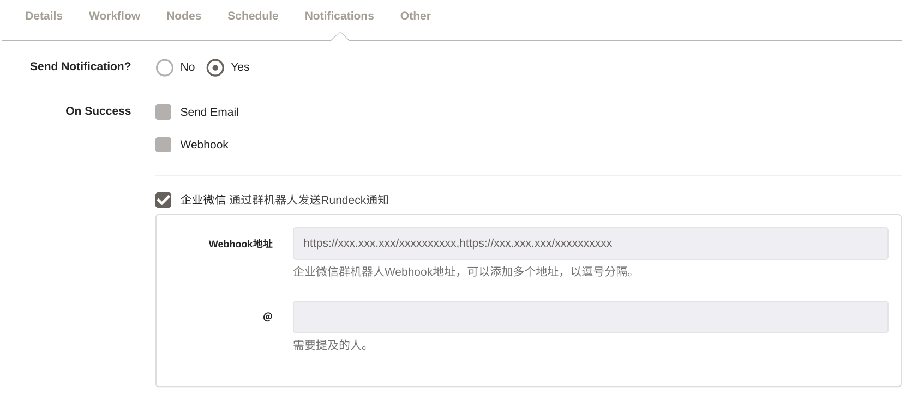
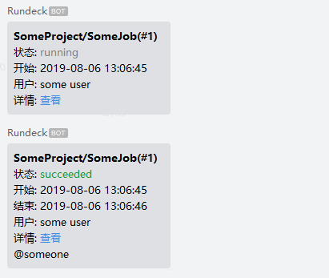

# rundeck-wechat-notification-plugin

本插件可将Rundeck通知通过群机器人Webhook发送到企业微信。

## 安装

1. 下载 [插件文件](https://github.com/tigerlee/rundeck-wechat-notification-plugin/releases/download/1.0.0/wechat-notification-plugin-1.0.0.jar)

```sh
wget "https://github.com/tigerlee/rundeck-wechat-notification-plugin/releases/download/1.0.0/wechat-notification-plugin-1.0.0.jar"
```

2. 将插件文件`rundeck-wechat-notification-plugin-1.0.0.jar`放到[插件目录](https://rundeck.org/docs/developer/plugin-development.html)

```sh
mv rundeck-wechat-notification-plugin-1.0.0.jar /var/lib/rundeck/libext
```

> 提示: Rundeck 3.0以上用户可以使用管理员账号在系统设置中上传插件。

3. 插件现在可以使用了。

## 从源码构建

```sh
$ git clone git@github.com:tigerlee/rundeck-wechat-notification-plugin.git
$ cd rundeck-wechat-notification-plugin
$ gradle build
# 或通过Docker
# docker run --rm -v "$PWD":/home/gradle/project -w /home/gradle/project gradle:6.0.0-jdk8 gradle build
```
## 使用说明
### 提供者: `WeChatNotificationPlugin`
### 插件属性:
 - __Webhook地址:__ 企业微信群机器人Webhook地址。可配置多个以逗号分隔的地址。示例: `https://qyapi.weixin.qq.com/cgi-bin/webhook/send?key=1234567890`  
  
 - __＠:__ 需要提及的人。由于Markdown消息不支持`@`指定用户，这里的`@`只起到显示作用，并不会有真正的`@`功能。

___
### 配置示例



___
### 企业微信消息示例


___

## 致谢

* [rundeck-diy-webhook-notification](https://github.com/theque5t/rundeck-diy-webhook-notification)
* [rundeck-rocketchat-notifier](https://github.com/JSzaszvari/rundeck-rocketchat-notifier)
